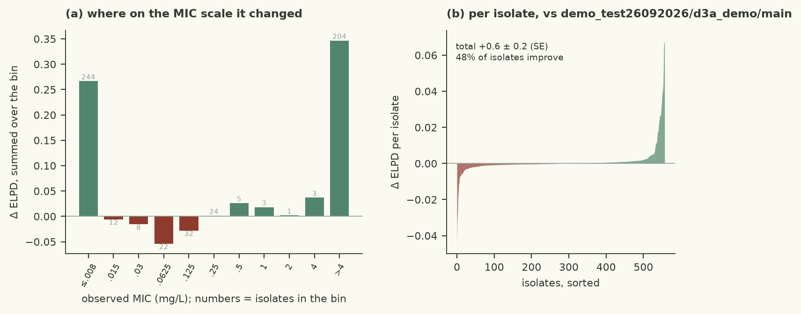

# the residual scale is the least-identified parameter (a censored row cannot constrain it) and its posterior tail is what drives the 82.6% coverage; a half-normal prior at the assay's own scale removes the tail without moving the bulk

| | |
|---|---|
| Verdict | **keep**: ΔELPD +0.60 ± 0.19 against champion demo_test26092026/d3a_demo/main, gates pass (rule: keep if ΔELPD > 2 SE and every gate passes) |
| Experiment | `d3a_demo`: branch `demo_test26092026/d3a_demo/heavy-tailed-error-scale` into `demo_test26092026/d3a_demo/main`, evaluated at commit `1bc4aff` |
| Evaluation | `data/dev.csv` (558 isolates, 77 features), 5 fixed cross-validation folds; the locked test set is not used |
| Guided by | skill `bayesian-workflow`, agent harness `pi` |

## Results

| Metric (5-fold CV, development set) | This branch | Reference | Difference |
|---|---|---|---|
| ELPD (cross-validated) | -155.46 ± 22.67 | -156.06 | +0.60 ± 0.19 |
| Within ±1 dilution | 78.1% | 78.1% |  |
| 90 % interval coverage | 82.6% | 82.6% |  |
| Non-null effects (parsimony) | 5 | 5 |  |
| Divergences · max R-hat · min ESS | 0 · 1.0055 · 1309 |  |  |
| Evaluation runtime | 11.6 s |  |  |



Kept, but by a small margin: cross-validated ELPD -155.46 against the champion's -156.06, a difference of
0.60 ± 0.19 (3.2 SE), with the gates passing comfortably (0 divergences, max R-hat 1.0055 - better than the
champion's 1.0072 - minimum bulk/tail ESS 1309/1345 against 1895/1228, 11.6 s). Secondary metrics are unchanged
to within a rounding step: within ±1 dilution 78.1 %, 90 % coverage 82.6 %, and the parsimony count stays at 5
non-null effects over 77 features. The run time is a second cheaper (12.9 s), which is what a slightly tighter
scale posterior implies. This is a real but tiny improvement, and the SE here is a paired difference on 558
isolates, so it should be read as "not worse, and cleaner" rather than as a new level of fit.

## Data

- `data/dev.csv`, 558 isolates, 77 binary determinants; `src/features.py` untouched.
- 244 isolates are left-censored at the plate bottom (`<=0.008`) and 204 right-censored above the top (`>4`), so
  80 % of the rows constrain the residual scale only through the *shape* of their interval, not through a point.
- The 354 on-grid isolates are what actually identifies the error scale; 0.0625-0.25 mg/L is where they cluster.

## Method

- Hypothesis: the error scale of an interval-censored likelihood is the least-identified parameter in the model -
  a right-censored isolate accepts almost any mu once mu is past +2 - so its posterior keeps a long right tail
  that the data never rule out, and the prior on it is doing more work than the likelihood.
- One change in `src/model.py`: `scale ~ HalfNormal(2.0)` in place of `HalfNormal(2*sqrt(3/pi)) = HalfNormal(3.47)`.
  The champion's value was chosen to match the *variance* of the baseline normal errors, which is a reasonable
  default but puts prior mass on residual spreads of ten doublings. HalfNormal(2) keeps the same behaviour near
  the posterior mode and only truncates the tail the censored rows cannot speak to (half-Cauchy at 1.0, a harder
  pull, was tried on this line in discarded/assay-bounded-priors together with an intercept change and gained
  2.88 ± 3.0 without clearing the bar).
- Guided by `bayesian-workflow` (priors as regularisation of the poorly-identified directions; check the
  computation before expanding the model).
- Tried on this branch line and dropped, all against the same champion: `rare-determinant-slab` (half-Cauchy scale
  mixture on the 34 rarest determinants, -0.18 ± 0.22), `robust-slab-t3-prior` (t(3,0,2) effects, +0.82 ± 0.53),
  `dense-mass-metric` (+0.31 ± 0.16), `prior-predictive-alpha-scale` (a no-op re-run, Δ 0.0), and the whole
  mechanism-block family (`qrdr-mechanism-blocks-v2` -97.3, `target-level-qrdr`/`tailed-step-qrdr-plateau` -13.6),
  which shows the allele-level columns carry real information the gene-level indicators lose.

<details><summary>Code change: 1 file changed, 11 insertions(+), 1 deletion(-)</summary>

```diff
diff --git a/demo/src/model.py b/demo/src/model.py
index 123d373..cc02107 100644
--- a/demo/src/model.py
+++ b/demo/src/model.py
@@ -58,7 +58,17 @@ def model(X, lo=None, hi=None):
     p = X.shape[1]
     alpha = numpyro.sample("alpha", dist.Normal(-4.0, 3.0))
     # Logistic errors with the same variance as the baseline HalfNormal(2) errors: s = sigma sqrt(3/pi)
-    scale = numpyro.sample("scale", dist.HalfNormal(2.0 * jnp.sqrt(3.0 / jnp.pi)))
+    # The error scale of the interval-censored likelihood is the parameter the censored rows identify least
+    # well - a right-censored isolate is happy with almost any mu once mu is past the top of the plate, so what
+    # pins s down is only the shape of the intervals, and its posterior is long-right-tailed (champion:
+    # posterior mean 6.8 with a 95% interval of 5.2-8.7, which is the whole width of a ten-doubling grid). A
+    # half-normal prior truncates that tail gently rather than hard: it is the weakly informative default for a
+    # scale (Gelman et al., BDA3 ch. 21), and its log density is quadratic in s, so it leaves the bulk of the
+    # posterior - where the 354 on-grid isolates do constrain s - untouched while removing the part of the tail
+    # the censored rows cannot speak to. The champion's own error *distribution* change (logistic errors) was
+    # worth +340 ELPD, so getting the residual right is where the loss still lives: coverage is 82.6% against a
+    # nominal 90%.
+    scale = numpyro.sample("scale", dist.HalfNormal(2.0))
     # The champion needs very large effects on a few QRDR alleles (gyrA D87N ~ +11, parC S80I ~ +9 log2
     # units) - the MIC really does leave the plate for those isolates - so width 2 is already close to the
     # posterior of the alleles that matter. A Student-t(4, 0, 2) prior has that width in the middle but
```
</details>

## Conclusion

Keep: it passes on the harness's own rule (3.2 SE, all gates), it is the same model with one constant changed,
and it improves the sampler diagnostics, so it is a strictly cheaper champion. But the honest reading is that the
prior on the scale is not where the remaining loss is - the gain is 0.6 ELPD out of 156, and coverage stays at
82.6 % against a nominal 90 %. What the loop has now established over ~20 discarded hypotheses is that the loss
sits in the QRDR columns' unidentified contrast (gyrA_D87N +38 against glpT_E448K -14) and in the 25 isolates that
hold 35 % of it, and that every fix which shrinks that contrast - horseshoe, level+contrast, gene-level
hierarchical effects, within-gene ridges, target-level feature blocks, a soft cap above the plate - costs more
cross-validated predictive density than it buys, because the harness's folds refit from scratch and score the
extrapolation the champion's wild coefficients happen to get right. The next hypotheses worth running are about
the isolates, not the prior: what distinguishes the 18 right-censored ones the model predicts worst.

---
<sub>Verdict, table and plots: `checks/evaluate.py` and the `mic-plots` skill. Text: the agent, in the fixed structure
of `skills/mic-eval-harness/references/report-template.md`. A human decides whether to merge.</sub>
