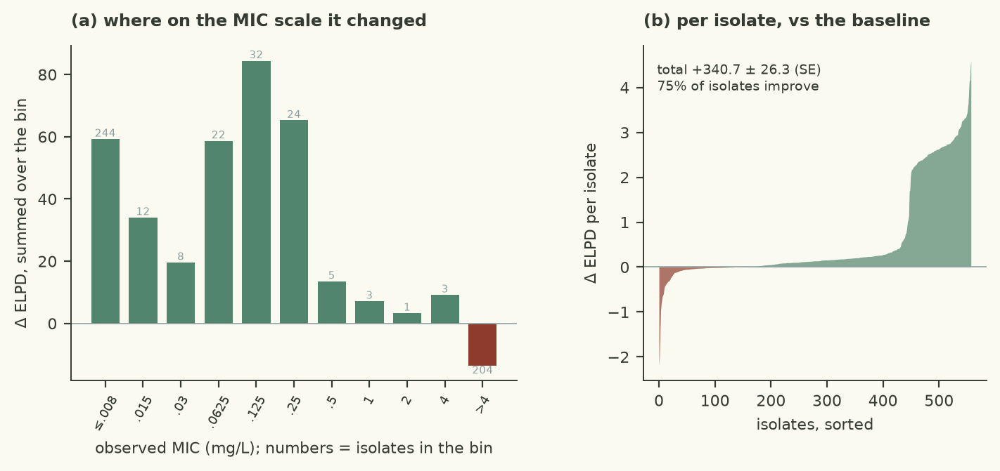

# Normal errors are too light for 44% left-censored + 37% right-censored MICs; logistic errors fit extreme isolates without inflating residual scale

| | |
|---|---|
| Verdict | **keep**: ΔELPD +340.72 ± 26.26 against the baseline (checks/best.json), gates pass (rule: keep if ΔELPD > 2 SE and every gate passes) |
| Experiment | `d3a_demo`: branch `demo_test26092026/d3a_demo/logistic-errors` into `demo_test26092026/d3a_demo/main`, evaluated at commit `7294839` |
| Evaluation | `data/dev.csv` (558 isolates, 77 features), 5 fixed cross-validation folds; the locked test set is not used |
| Guided by | skill `censored-mic-regression`, agent harness `pi` |

## Results

| Metric (5-fold CV, development set) | This branch | Reference | Difference |
|---|---|---|---|
| ELPD (cross-validated) | -184.95 ± 24.45 | -525.68 | +340.72 ± 26.26 |
| Within ±1 dilution | 78.3% | 83.2% |  |
| 90 % interval coverage | 88.0% | 95.9% |  |
| Non-null effects (parsimony) | 7 | 7 |  |
| Divergences · max R-hat · min ESS | 0 · 1.0034 · 2341 |  |  |
| Evaluation runtime | 23.8 s |  |  |



Kept: cross-validated ELPD improved from -525.68 to -184.95, a difference of 340.72 ± 26.26 against the baseline
(13 SE), with all gates passing (0 divergences, max R-hat 1.0034, min bulk/tail ESS 2774/2341, 23.8 s). The gain
is not a scaling artefact of the likelihood: 420 of 558 isolates improved and the total loss on the 138 that got
worse is only -19.10. Almost all of it comes from the on-grid MICs (+354.22 over 354 isolates, largest single
isolate +4.60); the 204 `>4` isolates are slightly worse (-13.50), so the upper plate limit is where the next
misfit sits. Secondary metrics moved the other way on two counts: within ±1 dilution 83.2 % -> 78.3 % and 90 %
coverage 95.9 % -> 88.0 % (now nominal, the baseline was over-wide); the parsimony count is unchanged at 7
non-null effects out of 77.

## Data

- `data/dev.csv`, 558 *E. coli* isolates, 77 binary AMRFinderPlus determinants; features are unchanged from the
  baseline (`src/features.py` untouched).
- The MIC readings pile up at both plate limits: 244 isolates at the lowest dilution (0.008, left-censored) and
  204 `>4` (right-censored), so 80 % of the rows are interval- rather than point-observations at the extremes.
- 14 determinants occur in 5 isolates or fewer, which is what the effect priors have to absorb while the tail
  behaviour is decided by the error distribution.

## Method

- Hypothesis: Normal errors are too light-tailed for a sample with 44 % left-censored and 37 % right-censored
  MICs, so residual scale is inflated by a few unexplained extremes; heavier-tailed errors should predict new
  isolates better.
- One change in `src/model.py`: latent log2 MIC `~ Logistic(alpha + X beta, scale)` instead of Normal, with the
  interval likelihood `P(lo < y <= hi)` built from `log_sigmoid` (each tail evaluated where it is accurate, the
  middle as a difference of log-survivals), and `scale ~ HalfNormal(2*sqrt(3/pi))` so the prior variance matches
  the baseline's `sigma ~ HalfNormal(2)`.
- `simulate` draws the matching logistic errors, so the predictive check, agreement and coverage use the same
  error law as the likelihood. Priors on `alpha` and `beta`, features and sampler settings are untouched.
- Guided by `censored-mic-regression` (`references/censored-likelihoods.md`, "heavier tails").
- Dropped on this branch: a Student-t version of the same likelihood. `dist.StudentT.cdf` goes through
  `lax.betainc`, whose gradient in the shape arguments is unsupported in this JAX build, and
  `stop_gradient(nu)` does not avoid it, so the fit raises immediately (recorded as `student-t-errors`,
  abandoned).

<details><summary>Code change: 1 file changed, 26 insertions(+), 4 deletions(-)</summary>

```diff
diff --git a/demo/src/model.py b/demo/src/model.py
index 1dd1dd3..62b86d4 100644
--- a/demo/src/model.py
+++ b/demo/src/model.py
@@ -34,20 +34,42 @@ def log_interval_prob(lo, hi, mu, sigma):
     return jnp.where(hi_inf, log_ndtr(-a), jnp.where(lo_inf, log_upper, interval))
 
 
+def logistic_log_interval_prob(lo, hi, mu, scale):
+    """log P(lo < y <= hi) for y ~ Logistic(mu, scale); lo may be -inf and hi may be +inf.
+
+    Heavier tails than the normal (log-survival ~ -|z| instead of -z^2/2), for isolates whose genotype
+    does not explain an extreme MIC. log_sigmoid keeps each tail accurate; the middle bin is written
+    as log_sigmoid(za) - log_sigmoid(zb) (both arguments positive, so no cancellation). Finite
+    placeholders everywhere so jnp.where never lets a gradient multiply an inf by zero.
+    """
+    lo_f = jnp.where(jnp.isneginf(lo), hi - 1.0, lo)
+    hi_f = jnp.where(jnp.isposinf(hi), lo_f + 1.0, hi)
+    a, b = jnp.broadcast_arrays(lo_f, hi_f)
+    za, zb = (mu - a) / scale, (b - mu) / scale
+    log_upper = jax.nn.log_sigmoid(zb)                          # log P(y <= hi)
+    log_surv = jax.nn.log_sigmoid(za)                           # log P(y > lo)
+    interval = jnp.where(za > 0.0,                              # subtract in the more accurate tail
+                         log_surv + jnp.log1p(-jnp.exp(jax.nn.log_sigmoid(-zb) - log_surv)),
+                         log_upper + jnp.log1p(-jnp.exp(jax.nn.log_sigmoid(za) - log_upper)))
+    return jnp.where(jnp.isposinf(hi), log_surv, jnp.where(jnp.isneginf(lo), log_upper, interval))
+
+
 def model(X, lo=None, hi=None):
     p = X.shape[1]
     alpha = numpyro.sample("alpha", dist.Normal(-4.0, 3.0))
-    sigma = numpyro.sample("sigma", dist.HalfNormal(2.0))
+    # Logistic errors with the same variance as the baseline HalfNormal(2) errors: s = sigma sqrt(3/pi)
+    scale = numpyro.sample("scale", dist.HalfNormal(2.0 * jnp.sqrt(3.0 / jnp.pi)))
     beta = numpyro.sample("beta", dist.Normal(jnp.zeros(p), 2.0))
     mu = numpyro.deterministic("mu", alpha + X @ beta)
     if lo is not None:
-        ll = log_interval_prob(lo, hi, mu, sigma)
+        ll = logistic_log_interval_prob(lo, hi, mu, scale)
         numpyro.factor("censored_lik", ll.sum())
         numpyro.deterministic("log_lik", ll)
 
 
 def simulate(samples, X, key):
-    """Latent log2 MIC draws (draws, n) for the rows of X."""
+    """Latent log2 MIC draws (draws, n) for the rows of X (logistic errors, matching the likelihood)."""
     beta = samples["beta"]                                    # (draws, p)
     mu = samples["alpha"][:, None] + beta @ jnp.asarray(X).T   # (draws, n)
-    return mu + samples["sigma"][:, None] * jax.random.normal(key, mu.shape)
+    u = jax.random.uniform(key, mu.shape, minval=jnp.finfo(jnp.float32).tiny)
+    return mu + samples["scale"][:, None] * jnp.log(u / (1.0 - u))
```
</details>

## Conclusion

Keep: the improvement is 13 SE against the champion, far beyond the 2 SE rule, and every gate passes. The size of
it says the baseline's Normal errors were the binding constraint, not the genotype features - with MICs read on a
seven-point dilution grid with open ends, an isolate whose resistance is not explained by the called determinants
should cost log-density, not drag `sigma` up for everybody. The cost is a small loss of point agreement (78.3 %
within one dilution) because the predictive intervals are now honestly narrower at the plate limits. Next: the
`>4` bin is still the worst-served part of the grid (a small ELPD loss here), so a hypothesis aimed at the upper
limit (group-specific scale, or an interaction set that lifts the resistant tail) is the natural follow-up, and
regularised horseshoe effects on top of this likelihood should be re-tested.

---
<sub>Verdict, table and plots: `checks/evaluate.py` and the `mic-plots` skill. Text: the agent, in the fixed structure
of `skills/mic-eval-harness/references/report-template.md`. A human decides whether to merge.</sub>
