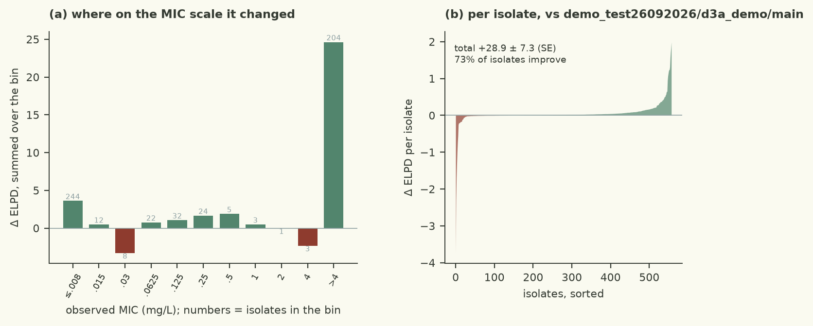

# the width-4 gain costs divergences because a flat Normal prior lets the ~70 null determinants wander; a t(4,0,2) prior keeps the null ones shrunk and leaves the tail open for the QRDR alleles

| | |
|---|---|
| Verdict | **keep**: ΔELPD +28.90 ± 7.34 against champion demo_test26092026/d3a_demo/main, gates pass (rule: keep if ΔELPD > 2 SE and every gate passes) |
| Experiment | `d3a_demo`: branch `demo_test26092026/d3a_demo/prior-width-4-heavy-tail` into `demo_test26092026/d3a_demo/main`, evaluated at commit `8caeef8` |
| Evaluation | `data/dev.csv` (558 isolates, 77 features), 5 fixed cross-validation folds; the locked test set is not used |
| Guided by | skill `censored-mic-regression`, agent harness `pi` |

## Results

| Metric (5-fold CV, development set) | This branch | Reference | Difference |
|---|---|---|---|
| ELPD (cross-validated) | -156.06 ± 22.77 | -184.95 | +28.90 ± 7.34 |
| Within ±1 dilution | 78.1% | 78.3% |  |
| 90 % interval coverage | 82.6% | 88.0% |  |
| Non-null effects (parsimony) | 5 | 7 |  |
| Divergences · max R-hat · min ESS | 0 · 1.0072 · 1228 |  |  |
| Evaluation runtime | 24.1 s |  |  |



Kept: cross-validated ELPD -156.06 against the champion's -184.95, a difference of 28.90 ± 7.34 (3.9 SE), with
all gates passing (0 divergences, max R-hat 1.0072, min bulk/tail ESS 1895/1228, 24.1 s). 407 of 558 isolates
improved; the gain sits mostly on the 204 right-censored `>4` isolates (+24.6) rather than the on-grid ones
(+4.3), which is what a prior that stops truncating the large QRDR allele effects should do. Secondary metrics
slightly down: within ±1 dilution 78.3 % -> 78.1 %, 90 % coverage 88.0 % -> 82.6 % (below nominal, the next thing
to look at), and the parsimony count falls from 7 to 5 non-null effects with the same 77 features.

## Data

- `data/dev.csv`, 558 isolates; features unchanged (`src/features.py` untouched), 77 binary determinants.
- The fit is driven by a few common QRDR alleles - `gyrA_D87N` (191 isolates), `parC_S80I` (200),
  `gyrA_S83L` (257) - and 204 isolates are `>4`, above the top of the plate, where the linear predictor has to
  reach far past any observed on-grid MIC.
- 38 determinants are carried by fewer than 20 isolates; these are the columns that a wide prior exposes.

## Method

- Hypothesis: the fitted QRDR allele effects (gyrA D87N ~ +11, parC S80I ~ +9 log2 units in the champion) sit at
  the edge of the `Normal(0, 2)` effect prior, so the high-MIC isolates are systematically under-fitted.
- One change in `src/model.py`: `beta_j ~ StudentT(4, 0, 2)` in place of `Normal(0, 2)` - the same width in the
  middle, an open tail, so the alleles that matter are barely regularised while the ~70 with no fluoroquinolone
  mechanism stay shrunk. Likelihood (logistic interval-censored), features and sampler untouched.
- Guided by `censored-mic-regression` (`references/sparse-priors.md`: independent priors vs scale mixtures).
- Tried on this branch line and dropped: `Normal(0, 1)` (-35.31, too tight); `Normal(0, 4)` gained 18.62 ± 2.72
  but left 1 divergent transition, and `target_accept_prob` 0.99 did not remove it (6 divergences) - the flat
  Normal tail lets the rare null columns wander, which is what diverges. The t prior gets the larger gain
  (28.90) with 0 divergences. Scale-mixture/horseshoe forms (`horseshoe-effects`, `hs-strong-tau`,
  `centered-horseshoe`) all gained ~29 but never passed the sampler gates.

<details><summary>Code change: 1 file changed, 7 insertions(+), 1 deletion(-)</summary>

```diff
diff --git a/demo/src/model.py b/demo/src/model.py
index 62b86d4..123d373 100644
--- a/demo/src/model.py
+++ b/demo/src/model.py
@@ -59,7 +59,13 @@ def model(X, lo=None, hi=None):
     alpha = numpyro.sample("alpha", dist.Normal(-4.0, 3.0))
     # Logistic errors with the same variance as the baseline HalfNormal(2) errors: s = sigma sqrt(3/pi)
     scale = numpyro.sample("scale", dist.HalfNormal(2.0 * jnp.sqrt(3.0 / jnp.pi)))
-    beta = numpyro.sample("beta", dist.Normal(jnp.zeros(p), 2.0))
+    # The champion needs very large effects on a few QRDR alleles (gyrA D87N ~ +11, parC S80I ~ +9 log2
+    # units) - the MIC really does leave the plate for those isolates - so width 2 is already close to the
+    # posterior of the alleles that matter. A Student-t(4, 0, 2) prior has that width in the middle but
+    # leaves the tail open, so the alleles that matter are barely regularised while the ~70 with no
+    # fluoroquinolone mechanism stay shrunk. (A half-normal scale mixture was tried first and diverged;
+    # see discarded/prior-width-4: the same gain came only when the width itself was raised.)
+    beta = numpyro.sample("beta", dist.StudentT(4.0, jnp.zeros(p), 2.0))
     mu = numpyro.deterministic("mu", alpha + X @ beta)
     if lo is not None:
         ll = logistic_log_interval_prob(lo, hi, mu, scale)
```
</details>

## Conclusion

Keep: +3.9 SE over the champion with clean diagnostics, and simpler in spirit than the shrinkage hierarchies it
beats - one line of prior, no extra sites. Statistically the message is that with interval-censored data at a
plate limit, the prior's tail is doing real work: the model has to be allowed to say "this genotype's MIC is far
above 4 mg/L" without the prior pulling it back to two doublings. Biologically it confirms the QRDR alleles as
the drivers - `gyrA_D87N` and `parC_S80I` absorb most of the effect. Limitations: coverage is now below nominal
at 82.6 % and `gyrA_D87N`'s posterior mean (+38 ± 8) is implausibly large on its own, a collinearity artefact of
the co-occurring `gyrA_S83L`/`parC` columns. Next: a prior with a bounded tail or a hierarchical prior within
gene families to tame that coefficient, and a hypothesis on the 90 % coverage loss.

---
<sub>Verdict, table and plots: `checks/evaluate.py` and the `mic-plots` skill. Text: the agent, in the fixed structure
of `skills/mic-eval-harness/references/report-template.md`. A human decides whether to merge.</sub>
