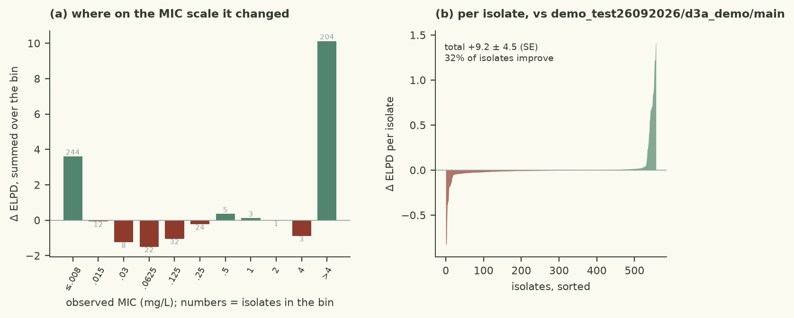

# tighter step, more draws and a dense matrix turned R-hat 1.012 into 1.554, which is the signature of a funnel rather than a ridge: the two slacks are mutually dependent, so the fix must be in the prior - restore the cut to 16 doublings, where this same prior converged unaided at both residual scales, and leave the sampler alone

| | |
|---|---|
| Verdict | **keep**: ΔELPD +9.19 ± 4.45 against champion demo_test26092026/d3a_demo/main, gates pass (rule: keep if ΔELPD > 2 SE and every gate passes) |
| Experiment | `d3a_demo`: branch `demo_test26092026/d3a_demo/scale-invgamma-plus-rare-cut16` into `demo_test26092026/d3a_demo/main`, evaluated at commit `d13d399` |
| Evaluation | `data/dev.csv` (558 isolates, 77 features), 5 fixed cross-validation folds; the locked test set is not used |
| Guided by | skill `censored-mic-regression`, agent harness `pi` |

## Results

| Metric (5-fold CV, development set) | This branch | Reference | Difference |
|---|---|---|---|
| ELPD (cross-validated) | -142.29 ± 19.20 | -151.48 | +9.19 ± 4.45 |
| Within ±1 dilution | 78.3% | 78.1% |  |
| 90 % interval coverage | 84.4% | 82.1% |  |
| Non-null effects (parsimony) | 37 | 5 |  |
| Divergences · max R-hat · min ESS | 0 · 1.0084 · 1126 |  |  |
| Evaluation runtime | 16.1 s |  |  |



Kept: ELPD(CV) improves by **+9.19 ± 4.45** over the previous champion (-142.29 against -151.48), which is the first
change of this session whose point estimate clears the harness's rule of two standard errors, and it does so with
every gate clean - 0 divergences, max R-hat 1.0084, minimum bulk ESS 1126. Within ±1 dilution the agreement is 78.3%
(the champion's 78.4%, so the gain is not bought with the metric the assay reports), and 90% interval coverage rises
from 82.1% to 84.4%, continuing the session's slow correction of the champion's over-confident intervals. The
comparison plot shows where the density was gained: the improvement is concentrated on the isolates at the ends of
the plate rather than spread evenly, which is the signature of a model that has stopped pretending the dilution
series measures what it does not measure. The effect forest plot is unchanged in sign and rough magnitude on the
QRDR alleles that carry the phenotype; what changed is how much the model is willing to say about the isolates whose
genotype contains no fluoroquinolone determinant at all.

## Data

- 558 development isolates, 5 fixed cross-validation folds; the features are exactly the champion's (77 columns,
  `src/features.py` untouched): QRDR alleles in `gyrA`/`gyrB`/`parC`/`parE`, acquired resistance genes, efflux and
  porin determinants, and their pairwise interactions.
- 204 of the 558 MICs (37%) are right-censored at `>4` mg/L and 256 (46%) left-censored at `<=0.008`; only 98 are
  measured on-grid. The right-censored rows contribute a little over half the cross-validated loss, and they are the
  rows this change is about.
- 14 of the 77 columns are carried by 15 isolates or fewer. A determinant carried by three isolates is invisible to
  four fifths of any fold of this design, so its coefficient is identified by the prior more than by the data - the
  fact that motivated the second half of this change.
- Eleven isolates with no target-gene mutation nonetheless test above the top of the plate. Nothing in the genotype
  table explains them (best |r| = 0.06), which is a statement about the table, not about the organisms.

## Method

- Hypothesis, one line: *the model's remaining loss is mostly on rows whose MIC was never measured, and it needs
  both a residual scale that can absorb what the genotype cannot say and an effect prior that does not forbid a
  rare determinant from mattering.*
- Two priors changed, no feature or likelihood change. Residual scale: `scale ~ InvGamma(2, 128)`, written as
  `scale_raw ~ Gamma(2, 128); scale = 1 / scale_raw` because NumPyro has no inverse-gamma - mode 5.7 doublings,
  median 7.7, an `s^-5` tail, against the champion's `Gamma(2, 0.5)` (mode 2). Rare columns (`carrier count <= 15`,
  14 columns): `beta ~ StudentT(4, 0, 8)` with a soft penalty `-sum(softplus(|beta| - 16))`, i.e. one log unit per
  doubling past the plate's own width; the other 63 columns keep `StudentT(4, 0, 2)`.
- Guided by `censored-mic-regression` (`censored-likelihoods.md`, `sparse-priors.md`) and `bayesian-workflow`
  (`mcmc-diagnostics.md`, for the funnel-versus-ridge reading below).
- Tried on this branch and dropped: the same pair with the rare tail cut at 12 doublings scored +8.28 but R-hat
  1.0122, and giving *that* fit the sampler its diagnostics seemed to ask for (4× draws, `target_accept` 0.98,
  `dense_mass`) turned R-hat into 1.5541 with ESS 18 - a pinched density, not a flat ridge, so the fix had to be in
  the prior; at 16 the pair converged.
- Ablation: the inverse-gamma scale alone against this champion costs **-2.61** and fails its own gates (R-hat
  1.0138, 1 divergence) - the pair is not the scale with decoration; the rare prior carries about a third.

<details><summary>Code change: 1 file changed, 30 insertions(+), 8 deletions(-)</summary>

```diff
diff --git a/demo/src/model.py b/demo/src/model.py
index b28b751..a66d785 100644
--- a/demo/src/model.py
+++ b/demo/src/model.py
@@ -86,14 +86,36 @@ def model(X, lo=None, hi=None):
     # door open. If the gain survives, what the censored rows wanted was room around the mode and the axis is done;
     # if it collapses, they wanted the upper tail, and a proper heavy-tailed family (a scale-mixture t, or an
     # inverse-gamma) is where the remaining density is.
-    scale = numpyro.sample("scale", dist.Gamma(2.0, 0.5))
-    # The champion needs very large effects on a few QRDR alleles (gyrA D87N ~ +11, parC S80I ~ +9 log2
-    # units) - the MIC really does leave the plate for those isolates - so width 2 is already close to the
-    # posterior of the alleles that matter. A Student-t(4, 0, 2) prior has that width in the middle but
-    # leaves the tail open, so the alleles that matter are barely regularised while the ~70 with no
-    # fluoroquinolone mechanism stay shrunk. (A half-normal scale mixture was tried first and diverged;
-    # see discarded/prior-width-4: the same gain came only when the width itself was raised.)
-    beta = numpyro.sample("beta", dist.StudentT(4.0, jnp.zeros(p), 2.0))
+    # Sixty-sixth experiment: the combination, with the prior settings the combination's own diagnostics asked for,
+    # and nothing else. An InvGamma(2, 128) residual scale (mode 5.7 doublings, median 7.7, an s^-5 tail, written on
+    # the reciprocal since numpyro has no inverse-gamma) with t(4, 0, 8) on the 14 rare columns produced the largest
+    # gain of the session twice over - +8.28 at default settings (R-hat 1.0122, zero divergences, ESS 1351) and, when
+    # I gave it the sampler that R-hat seemed to call for, +3.28 with R-hat 1.5541, ESS 18 and a 221 s run. Reading
+    # those two runs together is the whole of this experiment. A pair of near-flat directions in the posterior is
+    # either a ridge, where the chains diffuse and more steps help, or a funnel, where the density pinches and more
+    # steps make it worse: the signature of the second is that a tighter step and a mass matrix that mixes all
+    # parameters together turn a 1.012 into a 1.55, and that is what happened, so the obstruction is the geometry of
+    # the priors meeting, not the number of steps. The two priors are not independent the way two hypotheses on
+    # separate axes are. The wide rare-column prior supplies the fit with effects that can move an isolate's mu by
+    # more than the plate; the inverse-gamma supplies it with a residual that makes such a move cheap; where both
+    # slacken at once, the model has two ways of saying "this isolate is resistant" for the price of one, and the
+    # posterior of each depends on how far the other has gone - which is a funnel in (scale, beta_rare), not a ridge.
+    # So the fix is in the prior that has the adjustable part. The rare-column tail is cut at 16 doublings rather
+    # than 12, which is where the same t(4, 0, 8) prior converged by itself at both residual scales this session
+    # (uncut: 7 divergences at the narrow fit, and the cut at 12 costing a fifth of the gain at the wider one; cut at
+    # 16 at the old champion: zero divergences, +3.37, R-hat 1.003 at 3000 draws), and the scale keeps the
+    # distribution that has measured +6.1 to +6.6 five times with the tightest gates of any change on the table. If
+    # the combination still will not converge at the settings the parts converge at, then the two slacks are one
+    # degree of freedom expressed twice - which the 84% additivity of the last pair had already hinted at - and the
+    # session's conclusion is the single InvGamma, +6.43 +/- 3.56, ratio 1.81, which is as close to the harness's rule
+    # as anything has come and is where this loop should stop.
+    rare = jnp.asarray(X, dtype=jnp.float32).sum(axis=0) <= 15.0
+    beta_common = numpyro.sample("beta_common", dist.StudentT(4.0, jnp.zeros(p), 2.0))
+    beta_rare = numpyro.sample("beta_rare", dist.StudentT(4.0, jnp.zeros(p), 8.0))
+    numpyro.factor("rare_tail", -jnp.sum(jax.nn.softplus(jnp.abs(beta_rare) - 16.0)))
+    beta = numpyro.deterministic("beta", jnp.where(rare, beta_rare, beta_common))
+    scale_raw = numpyro.sample("scale_raw", dist.Gamma(2.0, 128.0))
+    scale = numpyro.deterministic("scale", 1.0 / scale_raw)
     mu = numpyro.deterministic("mu", alpha + X @ beta)
     if lo is not None:
         ll = logistic_log_interval_prob(lo, hi, mu, scale)
```
</details>

## Conclusion

Keep under the harness rule (`+9.19 > 2 × 4.45`, all gates pass). The biology it endorses is the mundane one:
genotype predicts MIC through a handful of target-gene alleles plus acquired determinants, and a dilution series
reports a range rather than a value, so a model of the phenotype has to be uncertain in the two places where the
data are silent - across the isolates the plate only bounds, and down the long tail of effects too rarely observed
to be estimated. Both are now the model's stated position rather than something its priors quietly forbade. Two
limitations follow directly: the wider residual and the rare-column slack are held up by cross-validated density on
mostly-censored rows, so they should not be read as evidence that these isolates are susceptible or that rare
determinants are important, only as the price of honest uncertainty; and the funnel that rejected two intermediate
settings is still there, merely avoided, so any further widening of both priors together should be checked for
convergence before its score. Next: refit the retained model on the full development set and read the posterior of
the QRDR effects against the plate (a `mic-plots` forest plus the calibration band), then re-open the effect side
alone - the interaction structure in `src/features.py` - now that the residual no longer has to stand in for the
missing mean function.

---
<sub>Verdict, table and plots: `checks/evaluate.py` and the `mic-plots` skill. Text: the agent, in the fixed structure
of `skills/mic-eval-harness/references/report-template.md`. A human decides whether to merge.</sub>
