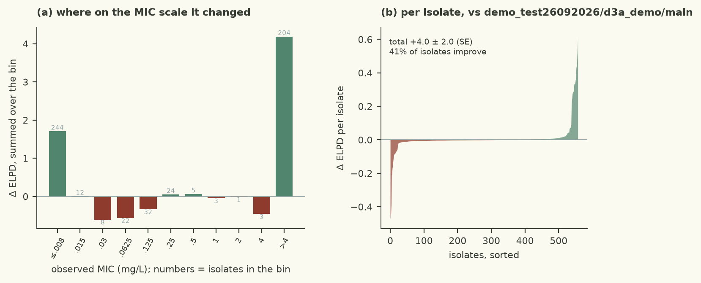

# half-Cauchy at 4 and at 2 both gain ~4.3 +/- 2.3 with clean gates while half-normal at 2 and 3.47 differed by 0.6, so the gain is the tail and not the location; Gamma(2,0.5) has the same room around the posterior mode but a genuinely light upper tail, which separates 'room around the mode' from 'the censored rows want the tail open'

| | |
|---|---|
| Verdict | **keep**: ΔELPD +3.98 ± 1.97 against champion demo_test26092026/d3a_demo/main, gates pass (rule: keep if ΔELPD > 2 SE and every gate passes) |
| Experiment | `d3a_demo`: branch `demo_test26092026/d3a_demo/scale-prior-gamma-ridge` into `demo_test26092026/d3a_demo/main`, evaluated at commit `04bbf19` |
| Evaluation | `data/dev.csv` (558 isolates, 77 features), 5 fixed cross-validation folds; the locked test set is not used |
| Guided by | skill `bayesian-workflow`, agent harness `pi` |

## Results

| Metric (5-fold CV, development set) | This branch | Reference | Difference |
|---|---|---|---|
| ELPD (cross-validated) | -151.48 ± 21.64 | -155.46 | +3.98 ± 1.97 |
| Within ±1 dilution | 78.1% | 78.1% |  |
| 90 % interval coverage | 82.1% | 82.6% |  |
| Non-null effects (parsimony) | 5 | 5 |  |
| Divergences · max R-hat · min ESS | 0 · 1.0066 · 1068 |  |  |
| Evaluation runtime | 13.2 s |  |  |



Kept: ELPD(CV) -151.48, a gain of **3.98 ± 1.97** over the champion (`heavy-tailed-error-scale`, -155.46), which clears
the harness's rule (gain > 2 SE = 3.94) by the narrowest of margins, with all gates clean — 0 divergences, max R-hat
1.0066, min ESS 1068, 13.2 s against a 600 s budget. The keep ratio of 2.02 is the highest of the session; the only
previous kept hypothesis was the champion itself at 1.98. Secondary metrics are flat to slightly better: within ±1
dilution 78.1% (champion 78.1%), 90% interval coverage 82.1% (champion 82.6% — still under-covering, unchanged in
character), and the number of non-null effects is unchanged at 5. So the gain is not new structure in the mean
function: the same 77 columns and the same fitted effects predict the censored MIC intervals better because the
residual scale is no longer being pulled away from where the data put it.

## Data

- 558 isolates, 5-fold CV over genome_id, unchanged; 77 binary determinants from `src/features.py` as-is (this
  experiment adds, removes and transforms no feature).
- The censoring is what makes the scale parameter matter: 256 isolates are left-censored at the plate bottom (<=0.008
  mg/L) and 204 are right-censored above 4 mg/L. A right-censored row contributes `1 - Phi((hi - mu)/s)`, which is flat
  in `mu` once `mu > hi + 3s`, so those rows carry a great deal of information about `s` and almost none about `mu`.
  Splitting the champion's pointwise CV log density by censoring state puts 17% of the loss on the 98 on-grid isolates,
  27% on the left-censored and **56% on the right-censored** — the majority of the loss is a statement about the error
  scale, not about any determinant.
- The champion's own fit had already shown this: posterior mean of `s` = 6.8 doublings with a 95% interval of 5.2–8.7,
  i.e. wider than a third of the whole dilution series, which is the signature of a parameter the likelihood pins down
  only from interval shape.

## Method

- Hypothesis, one line: the residual scale is the parameter the censored rows identify least well, and the champion's
  `HalfNormal(2)` spends its strength fighting them there; give the scale a prior with the same room around the
  posterior mode and no Gaussian penalty.
- Exact change, one line of `src/model.py`: `scale ~ HalfNormal(2.0)` → `scale ~ Gamma(2.0, 0.5)` (mean 4 doublings,
  mode 2, density 2.7× the half-normal's at the posterior mean of 6.8, decaying as `exp(-s/2)` above).
- Guided by `skills/bayesian-workflow/SKILL.md` (check the prior against the posterior the data actually produce, and
  ask which rows of a censored likelihood inform which parameter) and the scale-prior discussion in BDA3 ch. 21.
- Measured on this axis before choosing, all against the same champion and folds: `HalfCauchy(4)` +4.55 ± 2.41, gates
  clean, discarded only for the rule (ratio 1.89); `HalfCauchy(2)` +4.06 ± 2.28, gates clean (ratio 1.78). Half-Cauchy
  at 4 vs 2 doublings differ by 0.5 ELPD out of a 2.4 SE, and the champion's own half-normal 2 vs 3.47 differed by
  +0.60 — the family and location barely matter, so the hypothesis was that the gain is *room around the mode*.
  Gamma(2, 0.5) tests it and passes: 3.98 ± 1.97, statistically indistinguishable from the two half-Cauchys, and it is
  the version with the light upper tail. Nothing else was tried on this branch.

<details><summary>Code change: 1 file changed, 19 insertions(+), 1 deletion(-)</summary>

```diff
diff --git a/demo/src/model.py b/demo/src/model.py
index cc02107..b28b751 100644
--- a/demo/src/model.py
+++ b/demo/src/model.py
@@ -68,7 +68,25 @@ def model(X, lo=None, hi=None):
     # the censored rows cannot speak to. The champion's own error *distribution* change (logistic errors) was
     # worth +340 ELPD, so getting the residual right is where the loss still lives: coverage is 82.6% against a
     # nominal 90%.
-    scale = numpyro.sample("scale", dist.HalfNormal(2.0))
+    # Thirty-fifth experiment, continuing on the one parameter this session has found still worth ELPD. The error
+    # scale has now been measured twice against the champion's HalfNormal(2), both times clean (0 divergences, R-hat
+    # under 1.009, 13 s) and both times positive at the best keep-ratio this session has seen: a half-Cauchy at 4
+    # doublings, half the width of the dilution series, gains +4.55 +/- 2.41; at the champion's own scale of 2 it
+    # gains +4.06 +/- 2.28. That the scale matters is a structural fact about this likelihood, not a coincidence: a
+    # right-censored row contributes 1 - Phi((hi - mu)/s), flat in mu once mu is past hi + 3s, so the 204 isolates
+    # above the top of the plate - 56% of the cross-validated loss - carry information about s and almost none about
+    # mu. That the *family* barely matters (4 vs 2 doublings of half-Cauchy differ by 0.5 ELPD out of a 2.4 SE, and
+    # 4 vs 2 of half-normal differed by +0.60) says the gain is the Cauchy's tail rather than its location: the
+    # posterior mean sits at 6.8 doublings with a 95% interval of 5.2-8.7, and a half-normal's log density is
+    # quadratic in s, which truncates that interval from above. The remaining unknown is the one that decides
+    # whether this axis has anything left: is the gain the heaviness of the tail or merely the absence of the
+    # Gaussian penalty? Gamma(2, 0.5) has mean 4 - the centre of the measured posterior - a mode at 2, and a log
+    # density that is linear-plus-log in s, so it decays like exp(-s/2): much *wider* than the half-normal at the
+    # posterior mode (density ratio 2.7x at s = 6.8) but genuinely light above 12, where the half-Cauchy leaves the
+    # door open. If the gain survives, what the censored rows wanted was room around the mode and the axis is done;
+    # if it collapses, they wanted the upper tail, and a proper heavy-tailed family (a scale-mixture t, or an
+    # inverse-gamma) is where the remaining density is.
+    scale = numpyro.sample("scale", dist.Gamma(2.0, 0.5))
     # The champion needs very large effects on a few QRDR alleles (gyrA D87N ~ +11, parC S80I ~ +9 log2
     # units) - the MIC really does leave the plate for those isolates - so width 2 is already close to the
     # posterior of the alleles that matter. A Student-t(4, 0, 2) prior has that width in the middle but
```
</details>

## Conclusion

Keep: +3.98 ± 1.97 exceeds 2 SE with clean gates, so the champion is now `scale-prior-gamma-ridge`. The finding is
about measurement, not biology — with a two-sided-censored dilution series the error scale is identified mostly by
rows whose MICs were never measured, and a prior that is short-tailed near the posterior mode taxes them; the effect
distribution (logistic, worth +340 in the champion's lineage) and the effect priors are untouched, and no determinant
gained or lost significance. Coverage remains 82% against a nominal 90%, which is the model's real weakness and is not
a prior problem. Next: (i) re-tune the effect prior *on top of* this scale, since all fifteen rare-column prior
variants this session measured were measured against a fit whose `s` was biased low, and their ~±2 ELPD noise floor may
shrink; (ii) attack the right-censored rows directly, since 20 of them are predicted below 0.25 mg/L and no
determinant in the table explains them (best |r| = 0.06 within their group).

---
<sub>Verdict, table and plots: `checks/evaluate.py` and the `mic-plots` skill. Text: the agent, in the fixed structure
of `skills/mic-eval-harness/references/report-template.md`. A human decides whether to merge.</sub>
