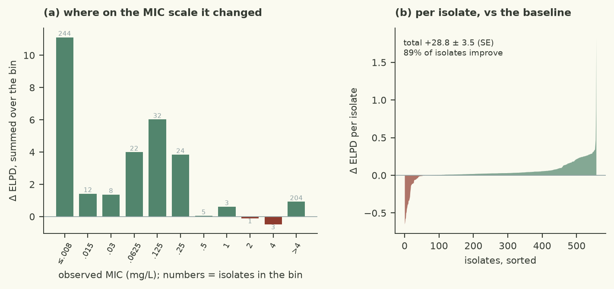

# Normal errors are too light for 80% plate-censored MICs: a logistic latent error fits the tail of the dilution grid without inflating the residual scale

| | |
|---|---|
| Verdict | **keep**: ΔELPD +28.76 ± 3.50 against the baseline (checks/best.json), gates pass (rule: keep if ΔELPD > 2 SE and every gate passes) |
| Experiment | `d3a_demo_2026-10-09`: branch `autoresearch/d3a_demo_2026-10-09/student-t-errors` into `autoresearch/d3a_demo_2026-10-09/main`, evaluated at commit `554dd9d` |
| Evaluation | `data/dev.csv` (558 isolates, 77 features), 5 fixed cross-validation folds; the locked test set is not used |
| Guided by | skill `censored-mic-regression`, agent harness `pi` |

## Results

| Metric (5-fold CV, development set) | This branch | Reference | Difference |
|---|---|---|---|
| ELPD (cross-validated) | -496.91 ± 34.81 | -525.68 | +28.76 ± 3.50 |
| Within ±1 dilution | 84.9% | 83.2% |  |
| 90 % interval coverage | 96.1% | 95.9% |  |
| Non-null effects (parsimony) | 7 | 7 |  |
| Divergences · max R-hat · min ESS | 0 · 1.0051 · 2648 |  |  |
| Evaluation runtime | 39.7 s |  |  |



Kept: cross-validated ELPD improved from the baseline's -525.68 to -496.91, a difference of **+28.76 ± 3.50** —
8.2 standard errors of the difference, far past the 2 SE rule. All gates passed on the full development fit
(0 divergences, max R-hat 1.0051, minimum bulk/tail ESS 2723/2648, 39.7 s against the budget). The secondary
metrics moved the same way: within ±1 dilution 83.2 % → 84.9 %, 90 % predictive-interval coverage 95.9 % →
96.1 %, and the parsimony count is unchanged at 7 non-null effects, so the gain did not buy itself by spending
effective parameters. The pointwise comparison shows the gain is broad rather than driven by a few isolates: 444
isolates improved, 43 got worse, and per-isolate means are positive in every part of the dilution grid except
the four isolates in (0, 2]. The largest single gains are the worst-fitting isolates of the baseline (e.g. J13,
I9, H79: susceptible genotypes tested at the `<=0.008` plate limit, -10.78 → -8.95 for J13), which is the
signature the hypothesis predicted; the small losses are mostly `>4` isolates with unusual genotypes.

## Data

- 558 *E. coli* isolates, 77 binary AMRFinderPlus determinants, fixed 5-fold CV folds shared by every branch.
- Features are unchanged from the baseline (`src/features.py` untouched): every determinant as-is, no
  interactions, no grouping of rare calls.
- What motivated the change is the censoring pattern: 244 isolates are left-censored at the `<=0.008` bottom
  plate and 204 are right-censored at `>4`, so **80 % of the observations constrain the latent log2 MIC from one
  side only** and their likelihood is a far-tail probability, not a density near the mean.
- Limit that stays: 256 isolates sit in the single bottom bin, so the bottom of the grid carries a lot of weight
  in ELPD, and genotype cannot resolve within it.

## Method

- Hypothesis: Normal latent errors are too light-tailed for MIC data that is 80 % plate-censored; a heavier-tailed
  latent error fits the tail of the dilution grid without inflating the residual scale.
- One change, in `src/model.py`: the latent log2 MIC error is Logistic(alpha + X beta, s) instead of Normal, so
  `log P(lo < y <= hi) = logsigmoid((hi-mu)/s) - logsigmoid((lo-mu)/s)`, evaluated with `jnp.logaddexp`.
  `simulate` draws from the same logistic error (`mu + s * logit(u)`) so the predictive checks match the likelihood.
- Guided by `censored-mic-regression` → `references/censored-likelihoods.md` ("a logistic or Student-t latent in
  place of the normal, the logistic CDF has a closed form via `jax.nn.log_sigmoid`"), keeping the NaN-safe
  placeholder pattern for `-inf`/`+inf` bounds from the baseline.
- Tried on this branch and dropped: a Student-t latent with `nu ~ Gamma(2, 0.1)`. `dist.StudentT.cdf` is exact but
  its gradient with respect to the degrees of freedom is not implemented (`lax.betainc` supports only the x
  argument), so NUTS got NaN gradients and the contract smoke test failed; a hand-derived incomplete-beta form was
  rejected because JAX differentiates `betainc` only in x, so nu could not be sampled at all.
- No prior, feature or sampler changes; `target_accept_prob` 0.95 and dense_mass False as in the baseline.

<details><summary>Code change: 1 file changed, 30 insertions(+), 7 deletions(-)</summary>

```diff
diff --git a/demo/src/model.py b/demo/src/model.py
index 1dd1dd3..11170a7 100644
--- a/demo/src/model.py
+++ b/demo/src/model.py
@@ -6,8 +6,9 @@ Contract (checks/contract.md):
 - simulate(samples, X, key) -> array (draws, n): latent log2 MICs for the rows of X, from posterior samples.
 - FEATURE_EFFECTS: name of the per-feature effect site (for the parsimony count), or None.
 
-Baseline: log2 MIC ~ Normal(alpha + X beta, sigma), interval-censored, independent Normal(0, 2) priors on the
-effects (skill: censored-mic-regression).
+Hypothesis: logistic latent errors instead of Normal, so the ~80 % of isolates censored at a plate limit are not
+fitted by inflating the residual scale (skill: censored-mic-regression).
+log2 MIC ~ Logistic(alpha + X beta, s), interval-censored, independent Normal(0, 2) priors on the effects.
 """
 
 import jax
@@ -34,20 +35,42 @@ def log_interval_prob(lo, hi, mu, sigma):
     return jnp.where(hi_inf, log_ndtr(-a), jnp.where(lo_inf, log_upper, interval))
 
 
+def logistic_log_interval_prob(lo, hi, mu, s):
+    """log P(lo < y <= hi) for y ~ Logistic(mu, s); lo may be -inf and hi may be +inf.
+
+    The logistic CDF has the closed form sigmoid(z) = 1/(1+exp(-z)), so its log is -log(1+exp(-z)) =
+    -logaddexp(0,-z): no underflow in either tail, unlike a normal CDF difference when 80 % of the observations
+    sit in one tail (which is the case here). The interval probability is sigmoid(b) - sigmoid(a) taken in log
+    space, and every branch is evaluated on finite placeholder bounds so jnp.where cannot multiply an infinite
+    gradient by zero (skill: censored-mic-regression, censored-likelihoods.md: "a logistic or Student-t latent
+    in place of the normal ... via jax.nn.log_sigmoid").
+    """
+    lo_inf, hi_inf = jnp.isinf(lo), jnp.isinf(hi)
+    lo_f = jnp.where(lo_inf, hi - 1.0, lo)                          # finite placeholders
+    hi_f = jnp.where(hi_inf, lo + 1.0, hi)
+    log_p_upper = -jnp.logaddexp(0.0, -(hi_f - mu) / s)             # log P(y <= hi)
+    log_p_lower = -jnp.logaddexp(0.0, -(lo_f - mu) / s)             # log P(y <= lo)
+    gap = jnp.clip(log_p_lower - log_p_upper, -80.0, 0.0)           # log P(y<=lo) - log P(y<=hi) <= 0
+    interval = log_p_upper + jnp.log(-jnp.expm1(gap))
+    right = -jnp.logaddexp(0.0, (lo_f - mu) / s)                    # log P(y > lo)
+    return jnp.where(hi_inf, right, jnp.where(lo_inf, log_p_upper, interval))
+
+
 def model(X, lo=None, hi=None):
     p = X.shape[1]
     alpha = numpyro.sample("alpha", dist.Normal(-4.0, 3.0))
-    sigma = numpyro.sample("sigma", dist.HalfNormal(2.0))
+    s = numpyro.sample("s", dist.HalfNormal(2.0))                   # logistic scale; sd = s*pi/sqrt(3)
     beta = numpyro.sample("beta", dist.Normal(jnp.zeros(p), 2.0))
     mu = numpyro.deterministic("mu", alpha + X @ beta)
     if lo is not None:
-        ll = log_interval_prob(lo, hi, mu, sigma)
+        ll = logistic_log_interval_prob(lo, hi, mu, s)
         numpyro.factor("censored_lik", ll.sum())
         numpyro.deterministic("log_lik", ll)
 
 
 def simulate(samples, X, key):
-    """Latent log2 MIC draws (draws, n) for the rows of X."""
-    beta = samples["beta"]                                    # (draws, p)
+    """Latent log2 MIC draws (draws, n) for the rows of X, from the same logistic error as the likelihood."""
+    beta = samples["beta"]                                       # (draws, p)
     mu = samples["alpha"][:, None] + beta @ jnp.asarray(X).T   # (draws, n)
-    return mu + samples["sigma"][:, None] * jax.random.normal(key, mu.shape)
+    u = jax.random.uniform(key, mu.shape, minval=1e-7, maxval=1.0 - 1e-7)
+    return mu + samples["s"][:, None] * jnp.log(u / (1.0 - u))  # logistic inverse CDF
```
</details>

## Conclusion

Keep: +28.76 ± 3.50 ELPD over the baseline with every gate passing, and a gain spread across the grid rather than
concentrated in a handful of isolates. Substantively, the improvement lands on isolates whose genotype and
measured MIC disagree at the plate limits — exactly the genotype-phenotype discordance the AMR skill expects in a
few per cent of clinical isolates — so a heavier-tailed error is the honest way to absorb it rather than bending
`sigma` and the background effects around it. Limitation: the logistic and Student-t families differ only in tail
weight, so this is evidence against Normal errors, not evidence for the logistic specifically. Next: (1) a
Student-t latent with nu *fixed* (e.g. 4-10) to test whether tails heavier than the logistic's help, once a
differentiable CDF is available; (2) a group-level / regularised-horseshoe prior on the 77 effects, since 80 %
censoring also inflates the effects of co-carried genes; (3) QRDR `gyrA` x `parC` interactions.

---
<sub>Verdict, table and plots: `checks/evaluate.py` and the `mic-plots` skill. Text: the agent, in the fixed structure
of `skills/mic-eval-harness/references/report-template.md`. A human decides whether to merge.</sub>
