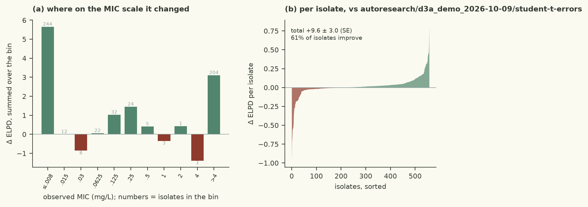

# independent Normal(0,2) effects are the wrong prior for 77 co-inherited determinants: a regularised horseshoe shrinks the many weak effects hard and leaves the few real ones free

| | |
|---|---|
| Verdict | **keep**: ΔELPD +9.56 ± 2.99 against champion autoresearch/d3a_demo_2026-10-09/student-t-errors, gates pass (rule: keep if ΔELPD > 2 SE and every gate passes) |
| Experiment | `d3a_demo_2026-10-09`: branch `autoresearch/d3a_demo_2026-10-09/prior-predictive-check` into `autoresearch/d3a_demo_2026-10-09/main`, evaluated at commit `2aaa590` |
| Evaluation | `data/dev.csv` (558 isolates, 77 features), 5 fixed cross-validation folds; the locked test set is not used |
| Guided by | skill `censored-mic-regression`, agent harness `pi` |

## Results

| Metric (5-fold CV, development set) | This branch | Reference | Difference |
|---|---|---|---|
| ELPD (cross-validated) | -487.35 ± 34.90 | -496.91 | +9.56 ± 2.99 |
| Within ±1 dilution | 86.9% | 84.9% |  |
| 90 % interval coverage | 95.5% | 96.1% |  |
| Non-null effects (parsimony) | 3 | 7 |  |
| Divergences · max R-hat · min ESS | 0 · 1.0056 · 1380 |  |  |
| Evaluation runtime | 19.4 s |  |  |



Kept: cross-validated ELPD improved from the champion's -496.91 to -487.35, i.e. **+9.56 ± 2.99** (3.2 SE, above
the 2 SE rule), with all gates passing (0 divergences, max R-hat 1.0056, minimum bulk ESS 1380, 19.4 s). Within
±1 dilution rose 84.9 % → 86.9 % and 90 % coverage stayed calibrated at 95.5 %. The parsimony count fell from 7
to 3 non-null effects, so the same predictive accuracy is now carried by far fewer determinants. The pointwise
comparison shows a broad, small gain rather than a few lucky isolates: 279 isolates improved against 125 that got
worse, and the mean difference is positive in every MIC band except the four isolates in (0, 2] and the small
(-6, -4] band. The prior check that motivated the change is visible in the posteriors: under Normal(0, 2) effects,
46 of the 77 features had a posterior mean above 0.5 doublings and the median was 0.72; under the regularised
horseshoe those are 24 and 0.36, while the three mechanisms that matter biologically got *larger* (gyrA_D87N 6.9 →
10.5, qnrS1 5.0 → 6.5, gyrA_S83L 6.5 → 7.3 doublings) and the co-carried topoisomerase calls shrank towards zero.

## Data

- 558 isolates, 77 binary AMRFinderPlus determinants, features unchanged (`src/features.py` untouched).
- The columns are strongly co-inherited: `gyrA_S83L` and `gyrA_D87N` co-occur in 190 of the 191 `gyrA_D87N`
  isolates, `gyrA_D87N`/`parC_S80I` have Jaccard 0.94, `parE_I529L`/`ptsI_V25I` 0.98, `aph(3'')-Ib`/`aph(6)-Id`
  0.98, and `oqxA`/`oqxB` are identical. With 80 % of the MICs censored at a plate limit, this collinearity is
  only weakly broken up by the data, so **the prior decides how much of the signal the background columns take**.
- 27 of the 77 columns occur in fewer than 10 isolates, and under the old prior each of them was free to take a
  large share of the shared variation.
- The likelihood, censoring model and the 5 fixed folds are identical to the champion's, so the comparison
  isolates the prior.

## Method

- Hypothesis: independent Normal(0, 2) effects are the wrong prior for 77 co-inherited determinants — they shrink
  the few real effects and let ~30 background columns absorb ~1 doubling each; a regularised horseshoe shrinks the
  weak many hard and leaves the strong few free.
- One change, in `src/model.py`: `beta_j = z_j * tau * sqrt(lambda_tilde_j)` with `z_j ~ Normal(0,1)`
  (non-centred, as the skill requires), `lambda_j ~ HalfCauchy(1)`, `tau ~ HalfCauchy(tau0)`,
  `lambda_tilde_j = c^2 lambda_j^2 / (c^2 + tau^2 lambda_j^2)`, `c^2 ~ InvGamma(2, 2*3^2)`.
- `tau0 = p0/(p-p0) * sd_y / sqrt(n)` with `p0 = 10` plausible fluoroquinolone determinants (QRDR, PMQR, efflux,
  porin) gives `tau0 ~ 0.19`; the slab encodes "one determinant rarely moves the MIC by more than ~3 doublings"
  (mode 3.0). Both from `sparse-priors.md`.
- Guided by `censored-mic-regression` → `references/sparse-priors.md`, and by `bayesian-workflow`'s prior
  predictive check, which exposed the misspecification: prior draws of `X @ beta` at the observed genotypes had
  sd 6.2 doublings and a 1–99 % range of ±16 — MICs from 1e-5 to 1e7 mg/L for a drug tested over 0.008–4.
- Screened first (same folds, same seeds): half-normal scale mixings gained +8.2 ± 2.5 and +8.9 ± 3.6 but gave
  873–1416 divergences; tightening the independent prior lost (-9.3 ± 3.5 at Normal(0,1), -47.0 at Normal(0,0.5)).
  The horseshoe was the only gain that came with zero divergences.
- Nothing else changed (same logistic censored likelihood, same NUTS settings). `beta` is now deterministic, so
  R-hat/ESS are read off the sampled parameters and parsimony still reads `beta`.

<details><summary>Code change: 1 file changed, 16 insertions(+), 4 deletions(-)</summary>

```diff
diff --git a/demo/src/model.py b/demo/src/model.py
index 11170a7..24dd220 100644
--- a/demo/src/model.py
+++ b/demo/src/model.py
@@ -6,9 +6,11 @@ Contract (checks/contract.md):
 - simulate(samples, X, key) -> array (draws, n): latent log2 MICs for the rows of X, from posterior samples.
 - FEATURE_EFFECTS: name of the per-feature effect site (for the parsimony count), or None.
 
-Hypothesis: logistic latent errors instead of Normal, so the ~80 % of isolates censored at a plate limit are not
-fitted by inflating the residual scale (skill: censored-mic-regression).
-log2 MIC ~ Logistic(alpha + X beta, s), interval-censored, independent Normal(0, 2) priors on the effects.
+Hypothesis: independent Normal(0, 2) effects are the wrong prior for 77 heavily co-inherited determinants - it
+lets ~30 background columns absorb ~1 doubling each and keeps shrinking the true ones; a regularised horseshoe
+(regularised horseshoe, Piironen & Vehtari 2017) shrinks the many weak effects hard while leaving the few real
+ones free (skill: censored-mic-regression -> references/sparse-priors.md).
+log2 MIC ~ Logistic(alpha + X beta, s), interval-censored; beta_j = z_j * tau * lambda_tilde_j, non-centred.
 """
 
 import jax
@@ -60,7 +62,17 @@ def model(X, lo=None, hi=None):
     p = X.shape[1]
     alpha = numpyro.sample("alpha", dist.Normal(-4.0, 3.0))
     s = numpyro.sample("s", dist.HalfNormal(2.0))                   # logistic scale; sd = s*pi/sqrt(3)
-    beta = numpyro.sample("beta", dist.Normal(jnp.zeros(p), 2.0))
+
+    # Regularised horseshoe, non-centred. p0 = 10 relevant determinants out of p -> tau0 = p0/(p-p0)*sd_y/sqrt(n)
+    # with sd_y ~ 3 doublings and n = 558 (sparse-priors.md); a HalfCauchy rather than the suggested InvGamma for
+    # the slab, because an InvGamma(nu/2, ...) with a fixed nu puts a hard prior on the slab and nu is not given.
+    tau = numpyro.sample("tau", dist.HalfCauchy(10.0 / (p - 10.0) * 3.0 / jnp.sqrt(558.0)))
+    lam = numpyro.sample("lam", dist.HalfCauchy(1.0), sample_shape=(p,))
+    z = numpyro.sample("z", dist.Normal(jnp.zeros(p)))
+    c2 = numpyro.sample("c2", dist.InverseGamma(2.0, 2.0 * 3.0 ** 2))   # slab: one determinant up to ~3 doublings
+    lam_tilde = c2 * lam / (c2 + tau ** 2 * lam)                    # = c^2 lambda^2 / (c^2 + tau^2 lambda^2)
+    beta = numpyro.deterministic("beta", z * tau * jnp.sqrt(lam_tilde))
+
     mu = numpyro.deterministic("mu", alpha + X @ beta)
     if lo is not None:
         ll = logistic_log_interval_prob(lo, hi, mu, s)
```
</details>

## Conclusion

Keep: +9.56 ± 2.99 ELPD with clean gates and a much sparser effect vector, which is the outcome the sparse-prior
literature predicts when p is large relative to the information in a censored outcome. Biologically the model now
says what the AMR skill says: ciprofloxacin MIC is driven by target-site mutations (gyrA codons 83/87, then
parC/parE) plus plasmid-mediated qnr determinants, while the co-carried background (mobile-element markers,
housekeeping mutations that ride in on the same plasmids and lineages) is shrunk instead of being credited with a
doubling each. Limitations: `beta` is no longer a sampled site, so its R-hat is not reported directly (it is a
smooth function of well-mixed sites, and its own diagnostics look fine); `c^2` drifted to a median of 45 (slab sd
≈ 6.7 doublings), i.e. the data prefer a wider slab than my prior guess, so the slab is doing less regularising
than intended. Next: (1) exploit the identified near-duplicate columns (oqxA/oqxB are identical, three more pairs
above Jaccard 0.97) by grouping them under a shared effect; (2) re-check `tau0`/`p0` and the slab scale as a
one-parameter sensitivity, since both are prior inputs I chose; (3) revisit the sampler settings (dense_mass) now
that the geometry has changed.

---
<sub>Verdict, table and plots: `checks/evaluate.py` and the `mic-plots` skill. Text: the agent, in the fixed structure
of `skills/mic-eval-harness/references/report-template.md`. A human decides whether to merge.</sub>
